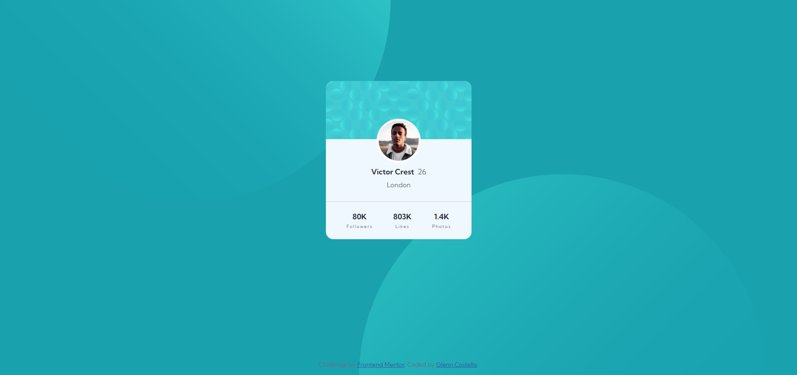

# Frontend Mentor - Profile card component solution

This is a solution to the [Profile card component challenge on Frontend Mentor](https://www.frontendmentor.io/challenges/profile-card-component-cfArpWshJ). Frontend Mentor challenges help you improve your coding skills by building realistic projects. 

## Table of contents

- [Overview](#overview)
  - [The challenge](#the-challenge)
  - [Screenshot](#screenshot)
  - [Links](#links)
- [My process](#my-process)
  - [Built with](#built-with)
- [Author](#author)

## Overview

### The challenge

- Build out the project to the designs provided

### Screenshot

### Links

- Live Site URL: [frontendmentor/profile-card-component-main](https://gccostello.github.io/websites.github.io/frontendmentor/profile-card-component-main/index.html#)

## My process

- Started with the HTML markup with class names. Moved on to the CSS and set up global settings and variables. Worked my way through the HTML elements and added CSS so it would be easy to follow and find code if needed.  

### Built with

- Semantic HTML5 markup
- CSS custom properties & variables for colors etc.
- Flexbox

## Author

- Frontend Mentor - [@GcCostello](https://www.frontendmentor.io/profile/GcCostello)